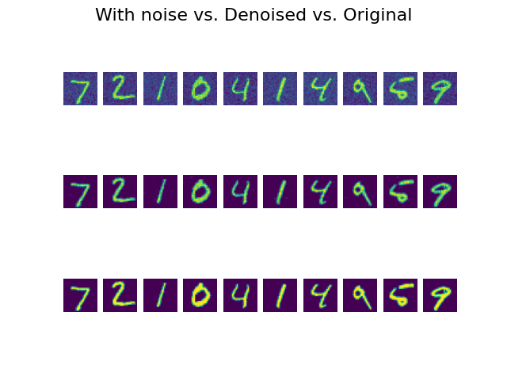

This project uses 3 .py files:
    1_generate_data.py: Data is read from mnist number dataset and adapted to the problem. Generates files
        x_test, x_train, y_test, y_train.
    2_train.py: A model is created based on the data from x_test, x_train, y_test, y_train. Generates a file
        with the model called model.h5.
    3_evaluate.py: The model is read from the file model.h5 and tested with an example. Feel free to test different
        examples.

Here you can observe some results of the DnCNN:

